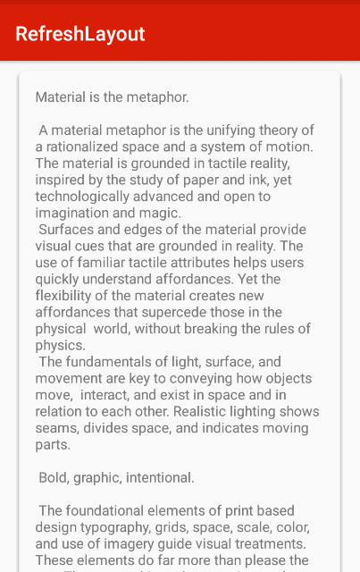
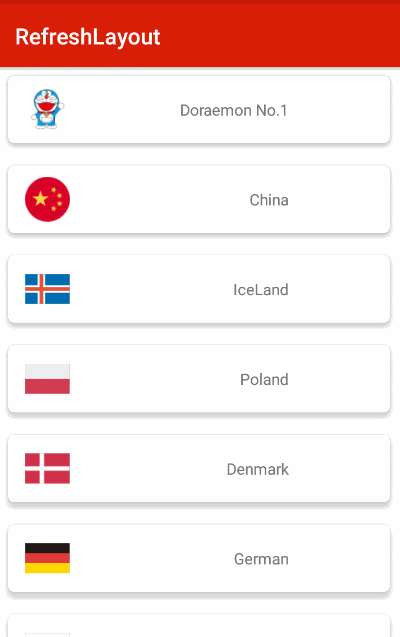
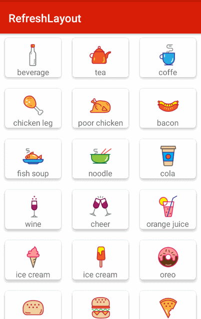

## RefreshLayout
基于嵌套滚动实现的支持下刷新和上拉加载更多的刷新控件

## Why
就想要个简单的刷新控件，用嵌套滚动这套机制去做最简单.实现起来逻辑很清晰,其实看到很多刷新控件，早一点的时候，很多
是在RecyclerView上添加item作为刷新头和尾，多了一层包装不是太合适，另外有种上拉加载更多直接就是添加滚动监听，当滚动到最后
自动触发loadMore，这样貌似也和刷新控件有些不太契合。最近看到SmartRefreshLayout这个项目是用嵌套机制实现的，模仿的SwipeRefreshLayout，感觉蛮不错的，
不过实现了NestedScrollingParent，又实现了NestedScrollingChild,窃以为没多大必要实现NestedScrollingChild，所以最后还是自己写一个精简版的算了....

## Display
 



## Usage
使用很简单，如果控件已经实现了NestedScrollingChild的像这样
```xml
        <com.refresh.RefreshLayout
            android:id="@+id/refreshlayout"
            android:layout_width="match_parent"
            android:layout_height="match_parent"
            app:targetId="@+id/recyclerView">
    
            <android.support.v7.widget.RecyclerView
                android:id="@+id/recyclerView"
                android:layout_width="match_parent"
                android:layout_height="match_parent"
                android:background="@android:color/darker_gray" />
    
        </com.refresh.RefreshLayout>
```
要是没有实现这个接口的，就包裹在SafeNestedScrollView里就好了，记得给RefreshLayout指定targetId

```xml
    
    <com.refresh.RefreshLayout
        android:id="@+id/refreshlayout"
        android:layout_width="match_parent"
        android:layout_height="match_parent"
        app:targetId="@+id/wrapper">

        <com.refreh.SafeNestedScrollView
            android:id="@+id/wrapper"
            android:layout_width="match_parent"
            android:layout_height="match_parent">

            <android.support.v7.widget.AppCompatTextView
                android:id="@+id/textview"
                android:layout_margin="16dp"
                android:layout_width="match_parent"
                android:layout_height="wrap_content"
                android:text="@string/large_text" />
        </com.refreh.SafeNestedScrollView>


    </com.refresh.RefreshLayout>
```
